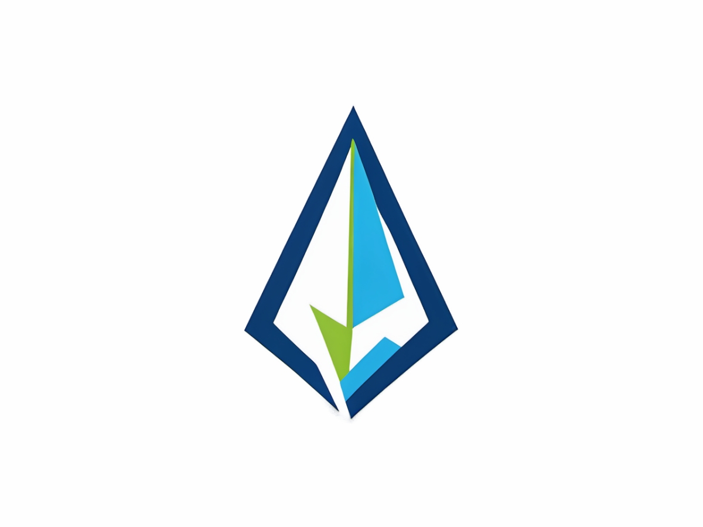

# SC2 Flow - 星程

<p align="center">
  
</p>


<p align="center">
  <a href="https://github.com/cairbin/SC2Flow/blob/main/LICENSE">
    
  </a>
  <a href="https://github.com/cairbin/SC2Flow/stargazers">
    
  </a>
  <a href="https://github.com/cairbin/SC2Flow/network/members">
    
  </a>
</p>


## 项目介绍
SC2 Flow - 星程是一个专为星际争霸2玩家设计的流程练习工具，帮助玩家通过系统化的训练提升游戏水平。支持IOS/Android/WEB等多平台。


### 核心功能

- **流程训练**：支持从流程商店拉去最新的战术流程
- **语音播报**：实时语音播报当前步骤，让玩家专注于游戏操作
- **流程导入**：支持从JSON文件导入自定义战术流程
- **推荐视频**：展示著名内容创作者和星际高玩链接
- **自定义设置**：可以自定义流程商店数据源仓库，方便玩家自建流程商店


### 技术栈

- **框架**：Flutter
- **状态管理**：Provider
- **本地存储**：SharedPreferences
- **网络请求**：HTTP
- **文本转语音**：Flutter TTS
- **文件选择**：File Picker
- **URL启动**：URL Launcher
- **字体**：SourceHanSansSC


## 使用方法

### 流程训练
1. 在首页选择你的阵营和对手阵营
2. 浏览可用的战术流程
3. 点击「下载」按钮下载流程（仅首次使用需要）
4. 点击「练习」按钮开始训练
5. 按照语音播报和计时器提示完成每个步骤

### 导入自定义流程
1. 点击底部导航栏的「导入流程」
2. 选择一个有效的JSON格式流程文件
3. 导入成功后，流程会出现在「我的流程」标签页中

### 设置
1. 点击底部导航栏的「设置」
2. 可以开启/关闭语音播报
3. 调整语音速度
4. 修改战术仓库URL
5. 开启调试模式查看日志


## 开发环境运行

### 前提条件

- 安装 [Flutter SDK](https://flutter.dev/docs/get-started/install)
- 配置好Android或iOS开发环境

### 运行步骤

1. 克隆项目到本地
```bash
git clone <repository-url>
cd sc2_upper_flutter
```

2. 安装依赖
```bash
flutter pub get
```

3. 运行应用
- 在Chrome浏览器中运行
```bash
flutter run -d chrome
```


## 打包APK

请参考Flutter官方文档打包APK：[打包APK](https://flutter.dev/docs/deployment/android)

（请务必注意`android/key.properties`文件，此文件需要你手动创建，里面包含密钥信息，谨防敏感信息泄露）

## 许可证

本项目采用 Apache License 2.0 开源协议。你可以在遵守协议的前提下自由使用、修改和分发本项目的代码。

详细信息请参阅 [LICENSE](https://github.com/cairbin/SC2Flow/blob/main/LICENSE) 文件。

此协议仅适用于本项目的代码，不包括任何第三方库或资源。